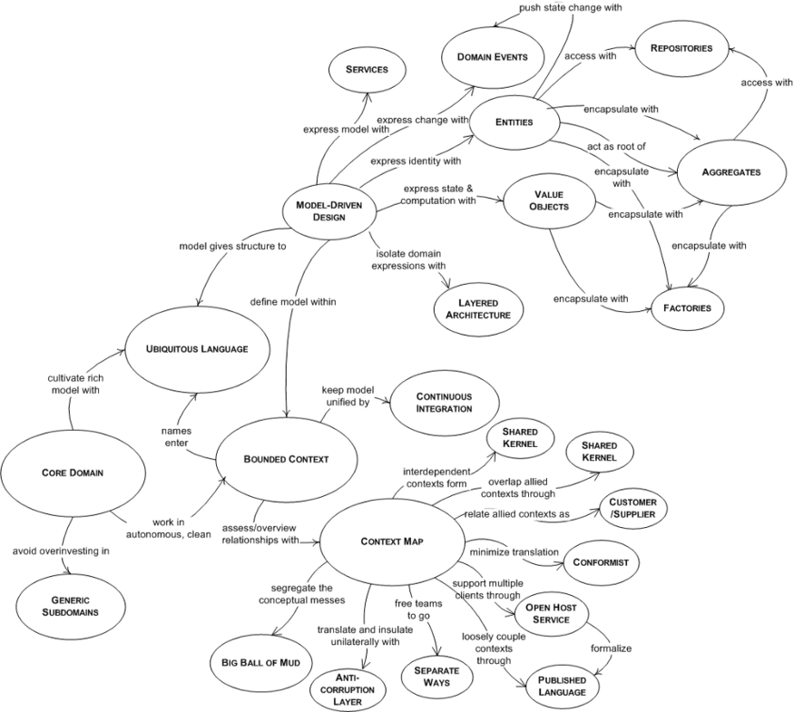
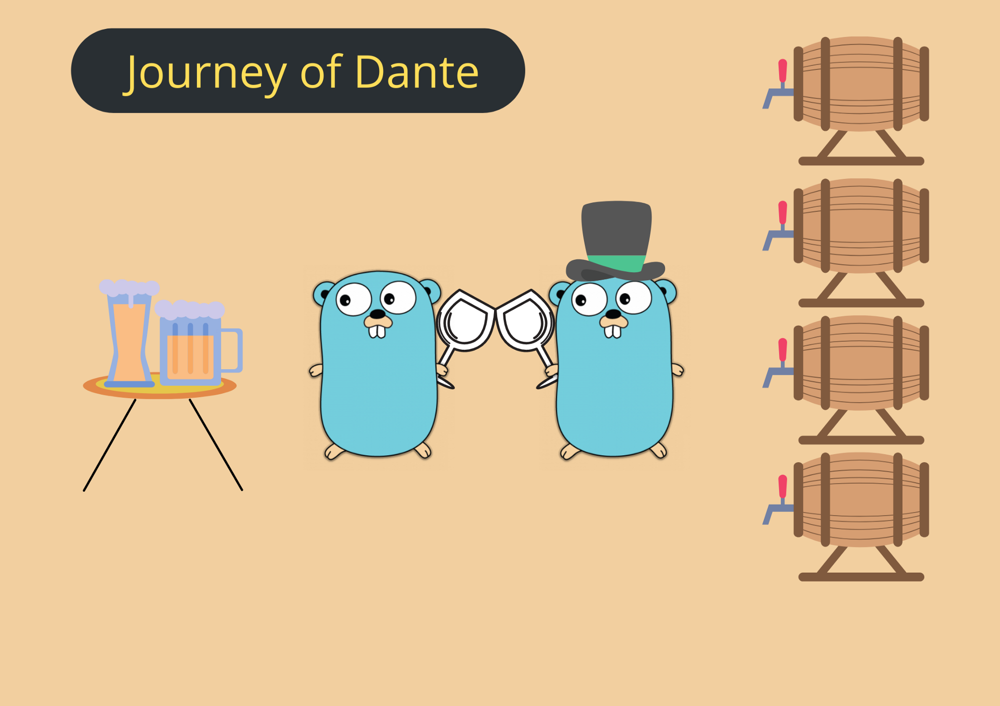
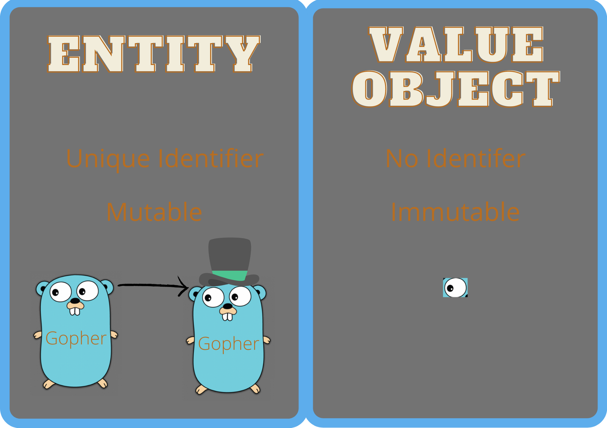
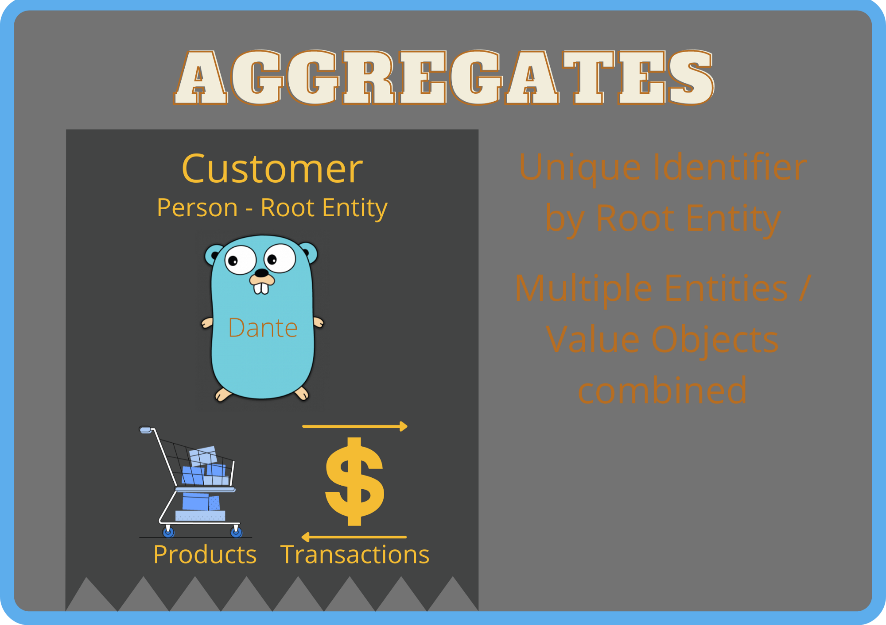
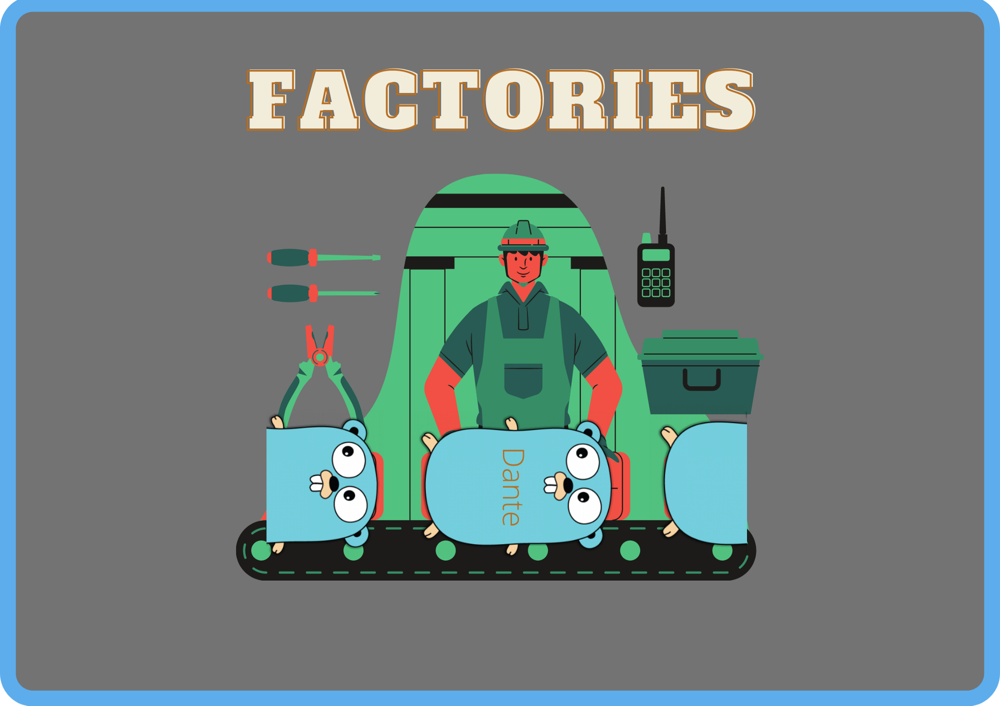
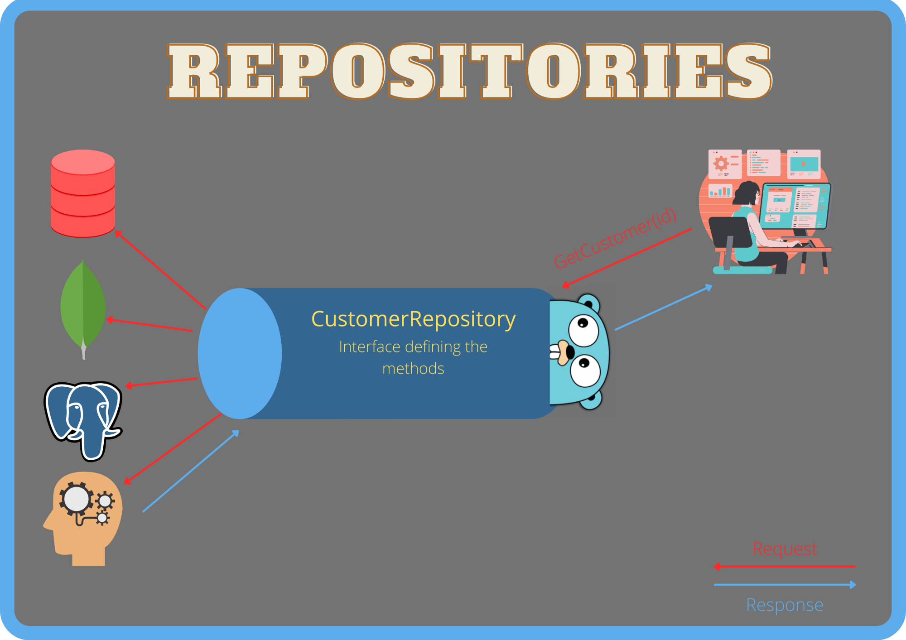
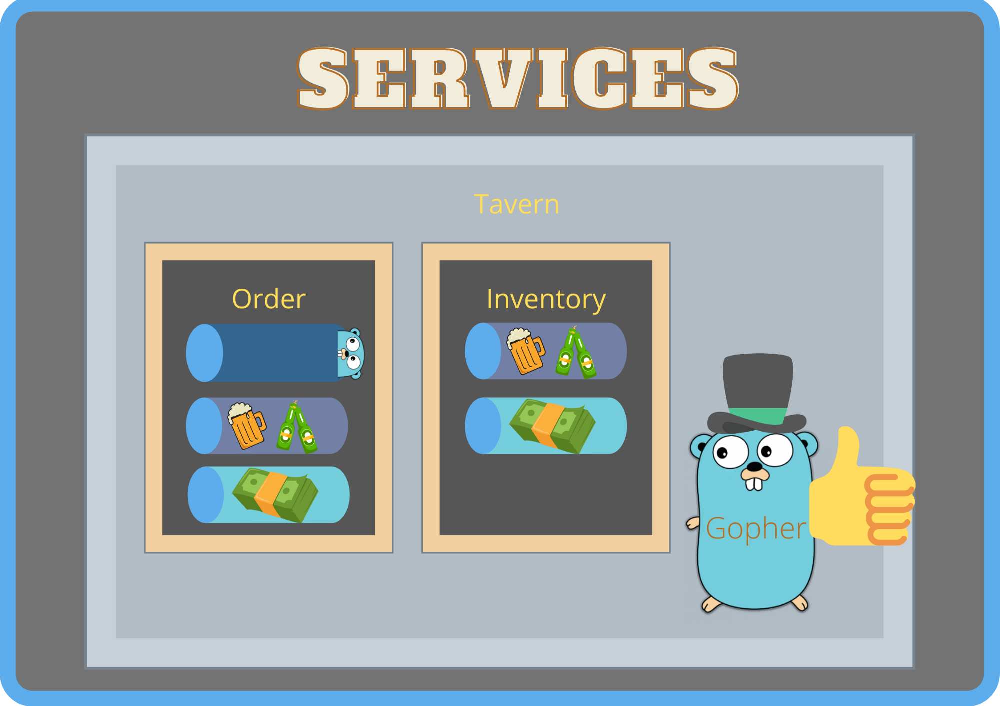
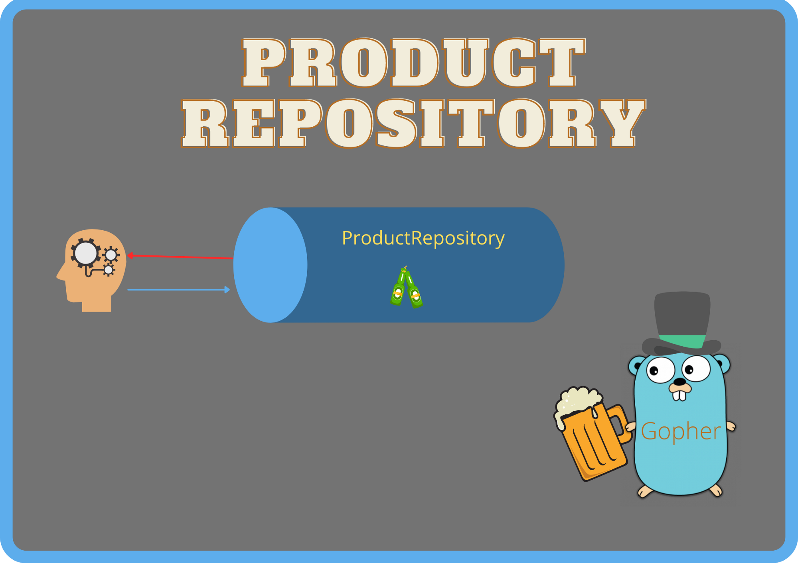
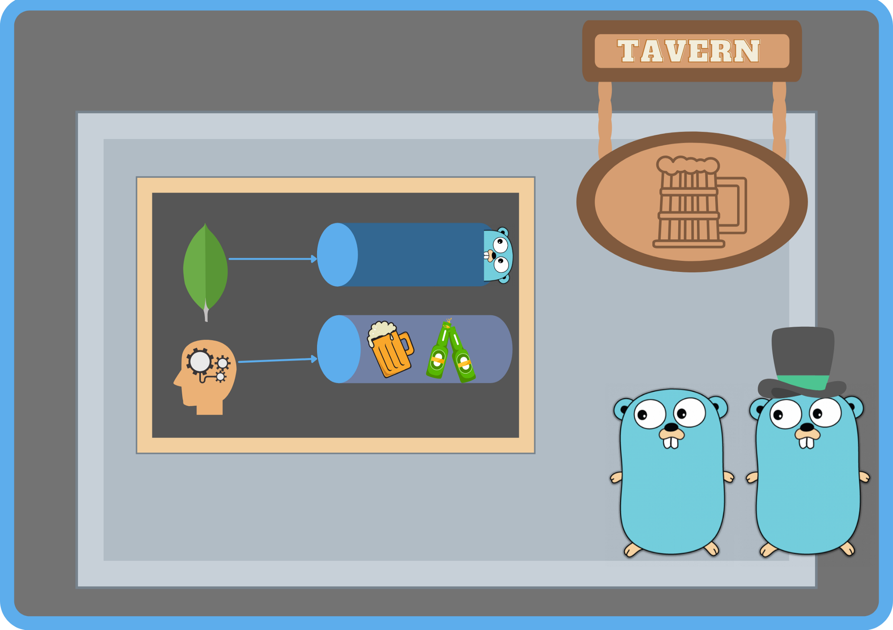
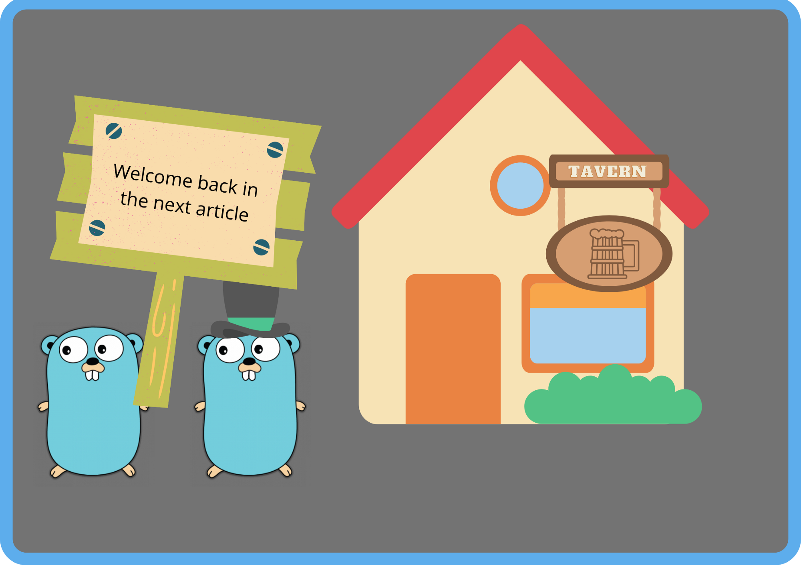

# Реализация предметно-ориентированное проектирования в Golang


*Рисунок создан Percy Bolmér. Gopher - Takuya Ueda, оригинальный Go gopher - Renée French (CC BY 3.0)*

В последние годы микросервисы стали очень популярным подходом при создании 
программного обеспечения. Они используются для создания масштабируемого и 
адаптирующегося программного обеспечения. Однако беспорядочное создание 
микросервисов разными командами может приводить к большим неудобствам и 
сложностям.

О предметно-ориентированном проектировании я слышал уже давно, но в последнее 
время о нём говорят все.

> Все изображения из этой статьи созданы Percy Bolmér, Gopher создан [Takuya Ueda](https://twitter.com/tenntenn),
> вдохновленный работами Renée French. gopher был модифицирован на изображениях.

В этой статье мы создадим онлайн-таверну с нуля, шаг за шагом, исследуя 
различные части DDD. Я надеюсь, что DDD будет легче понять, если создавать 
проект по частям. Такой подход используется, поскольку для меня чтение статей 
о DDD - это взрыв мозга. В них очень много специализированной терминологии и
сложно разобраться что к чему.

Если вам интересно почему я назвал изучение DDD "взрывом мозга", приведенный 
ниже рисунок, вероятно, поможет вам это понять.



*Ключевые понятия в DDD - Граф из книги Эрика Эванса Предметно-ориентированное
проектирование: структуризация сложных программных систем*

Вот почему Эрику Эвансу потребовалось примерно 500 страниц, чтобы объяснить это
в книге "Предметно-ориентированное проектирование: структуризация сложных 
программных систем". Если вы действительно заинтересованы в изучении DDD, 
прочитайте книгу Эванса. Вы можете купить её на [Amazon](https://amzn.to/3yd920L).

> Обратите внимание, что ссылка является партнерской, это означает, что я также 
> получаю процент, когда она используется для покупки.

Прежде всего, я хочу отметить, что в этой статье описывается моя 
интерпретация DDD. Реализация, которую я показываю в статье, основана на 
моем опыте работы с проектами, связанными с Go. Она не является принятой 
сообществом лучшей практикой. Кроме того я буду **называть папки в проекте в 
соответствии с методологией DDD, чтобы упростить понимание и вам было проще 
повторять за мной**. Но работать с таким репозиторием я бы не хотел, поэтому я 
создам отдельную ветку, в которой изменю структуру. Рефакторинг подробно 
описывается во [второй статье](https://towardsdatascience.com/how-to-structure-ddd-in-golang-28a7c3e7263b).

Я видел много жарких споров в Интернете о DDD и о том как его правильно 
реализовать. Меня поражает то, что в большинстве случаев люди кажется забывают 
цель, лежащую в основе DDD, и вместо этого начинают спорить о мелких деталях 
реализации. Я думаю, что важна методология, предложенная Эвансом, а не почему 
что-то названо X или Y.

DDD - это огромная область, и мы в основном рассмотрим ее реализацию. Но 
перед тем, как что-либо делать, я кратко напомню некоторые аспекты DDD.

## Что такое DDD?

Предметно-ориентированное проектирование — это способ структурирования и 
моделирования программного обеспечения с использованием предметной области, к
которой оно принадлежит. Это означает, что сначала нужно изучить предметную 
область, для которого пишется программное обеспечение. Предметная область — это 
задача или проблема, которую пытается решить программное обеспечение. 
Программное обеспечение должно быть написано так, чтобы отражать предметную 
область.

DDD пропагандирует, чтобы группа разработчиков встретилась с экспертами 
предметной области, SME. Это связано с тем, что SME владеют знаниями о предметной
области и эти знания должны быть отражены в программном обеспечении. И в этом есть
большой смысл: если бы я создавал платформу для торговли акциями, знаю ли я, 
как инженер, предметную область достаточно хорошо, чтобы спроектировать хорошую
платформу? Она, вероятно, была бы намного лучше, если бы я несколько раз встретился
бы с Уорреном Баффетом, поговорив о предметной области.

Архитектура кода также должна отражать предметную область. Мы увидим, 
как это сделать, когда начнем писать наше приложение: "Таверну".



Два gophera отмечают успешное сотрудничество. Gopher создан Takuya Ueda, 
оригинальный Go gopher - Renée French.

## История Gophera с точки зрения DDD

Начнём изучение DDD и для начала я хотел бы рассказать вам историю о Gopherе
Данте, который хотел создать онлайн таверну. Данте умеет писать код, но ничего
не знает о том, как управлять таверной.

В тот день, когда Данте решает начать создавать таверну, сразу возникает 
проблема: с чего и как начать? Он решает прогуляться, чтобы поразмышлять о своих
проблемах. Пока Данте ждал зеленого сигнала светофора, к нему подошёл мужчина 
в цилиндре сказал:

> «Похоже, вас что-то беспокоит, молодой человек, возможно, вам нужна помощь 
> в создании таверны?»

Данте и человек в цилиндре отлично проводят время, обсуждая таверну и то, как
она должна работать.

Данте спрашивает, что делать с заядлыми пьяницами, регулярно посещающими
таверну, а человек в цилиндре поправляет его, говоря, что их следует называть 
Клиентами, а не пьяницами.

Человек в цилиндре также объясняет Данте, что для работы таверне нужны: Клиенты
(`Customers`), Обслуживающий Персонал (`Employees`), Бухучёт (`Banking`) и Поставщики
(`Suppliers`).

## Предметная область, модель, единый язык и подобласти

Надеюсь, вам понравилась история о Данте, поскольку я писал её не просто так. Мы
можем использовать историю для того, чтобы лучше понять некоторые ключевые 
термины, применяемые в DDD, или понятия, которые мне трудно объяснить, не 
помещая их в контекст, даже такой короткой истории.

Между Данте и человеком в цилиндре состоялся разговор, касающийся моделирования
предметной области (`Domain`). Человек в цилиндре как эксперт и Данте как инженер обсудили
предметную область и нашли общий язык. Это нужно для того, чтобы изучить модель
(`Model`), модель — это абстракция компонентов, необходимых для управления 
предметной областью.

Когда Данте и человек в цилиндре обсуждали таверну, они говорили о том, что 
мы называем предметной областью (`Domain`). Предметная область — эта область,
в которой будет работать программное обеспечение. Я бы назвал таверну смысловым
ядром (Core/Root domain).

Человек в цилиндре также подчеркнул, что посетителей таверны следует называть 
Клиентами, а не пьяницами. Это показывает, насколько важно найти общий язык 
между специалистами и разработчиками. Легко запутаться, если все в проекте не 
используют единый язык (`Ubiquitous Language`).

У нас также есть несколько подобластей (`Sub-domains`), о которых упомянул человек в цилиндре.
Подобласть — это отдельная предметная область, используемая для решения задач 
внутри смыслового ядра.

## Программируем DDD приложение на Go - сущности и объекты-значения



*Отличия сущностей от объектов-значений. Gopher создан Takuya Ueda,
оригинальный Go gopher - Renée French.*

Пора начать писать код приложения "Таверна", после того как мы узнали всё 
необходимое для начала. Задайте go модуль:

```shell
mkdir DDD-and-go
go mod init github.com/MaksimDzhangirov/DDD-and-go
```

Создадим папку `domain`, в которой мы будем хранить все подобласти, необходимые
нам. Прежде чем реализовать любую из них, добавьте ещё одну папку в корневой 
каталог. В демонстрационных целях мы назовем его `entity`, поскольку она будет 
содержать то, что называется сущностями (`Entity`) в DDD.

Сущность — это структура, имеющая идентификатор, которая может изменять своё 
состояние. Под изменением состояния подразумевается, что значения сущности 
могут изменяться.

Для начала мы создадим две сущности: `Person` и `Item`. Я люблю хранить свои 
сущности в отдельном пакете, чтобы их можно было использовать в других 
предметных областях.

Чтобы код оставался чистым, я разбиваю большие файлы на несколько маленьких. Это
также упрощает навигацию по структуре проекта. Таким образом, я рекомендую создать 
два файла, по одному для каждой сущности, где их названия будут совпадать с 
названиями сущностей. Пока что в них будут только определения структур, но позже 
возможно мы добавим в них и другую логику.

```go
// Сущности внутри пакета являются общими для всех подобластей
package entity

import (
    "github.com/google/uuid"
)

// Person - это сущность, которая описывает человека во всех предметных областях
type Person struct {
    // ID - идентификатор сущности, ID общий для всех подобластей
    ID uuid.UUID
    // Name - это имя человека
    Name string
    // Age - это возраст человека
    Age int
}
```
*Сущность Person, описывающая человека*

```go
package entity

import "github.com/google/uuid"

// Item представляет собой элемент для всех подобластей
type Item struct {
    ID          uuid.UUID
    Name        string
    Description string
}
```
*Сущность Item (позиция на складе), является основной для товаров*

Отлично теперь мы задали несколько сущностей и узнали что такое сущность 
(структура с уникальным идентификатором, имеющая состояния, которые могут 
изменяться).

Могут возникнуть ситуации, когда у нас есть неизменяемые структуры, которым не
нужен уникальный идентификатор. Эти структуры называются объектами-значениями.
Объекты-значения часто встречаются внутри предметной области и используются для
описания его характеристик. На данный момент мы создадим один объект-значение,
`Transaction`. После своего выполнения, она не может изменить состояние.

> В настоящем приложении, транзакции удобно было бы отслеживать по ID, но 
> для учебных целей мы сделали её объектом-значением

```go
package valueobject

import (
    "github.com/google/uuid"
    "time"
)

// Transaction - информация об оплате
type Transaction struct {
    // все значения заданы заданы в нижнем регистре, поскольку неизменяемы
    amount    int
    from      uuid.UUID
    to        uuid.UUID
    createdAt time.Time
}
```
*Содержит информацию о проведенной оплате между двумя сторонами*

## Агрегаты — объединение сущностей и объектов-значений



*Агрегаты — объединение сущностей и объектов-значений*

Пришло время взглянуть на следующую составляющую DDD - агрегаты. Агрегат — 
совокупность взаимосвязанных сущностей и объектов-значений. В нашем случае 
создадим новый агрегат — Клиент (`Customer`).

DDD агрегаты — это понятия предметной области (заказы, посещение больницы, 
плейлист) - [Martin Fowler](https://martinfowler.com/bliki/DDD_Aggregate.html)

Мы используем агрегат, так как бизнес-логика будет находиться в агрегате 
`Customer`, а не в каждом объекте `Entity`. Агрегат запрещает прямой доступ к 
сущностям внутри него. Также часто для правильного представления данных он 
должен состоять из нескольких сущностей. Например, агрегат `Customer` состоит из
сущности "Человек" (`Person`), но также содержит купленные товары (`Products`) и 
осуществляет транзакции (`Transactions`).

Важным правилом для агрегатов в DDD является то, что в них должна быть только 
одна корневая сущность (`root entity`). Это означает, что ссылка на корневую 
сущность также является ссылкой на агрегат. Для агрегата `Customer` это 
означает, что идентификатор сущности `Person` является его уникальным 
идентификатором.

Создадим папку `aggregate` и файл `customer.go` внутри него.

```shell
mkdir aggregate
cd aggregate
touch customer.go
```

В файл мы добавим новую структуру `Customer`, и она будет 
содержать все необходимые сущности для представления клиента. Обратите внимание,
что все поля в структуре начинаются со строчных букв. Таким образом в Go объект
становится недоступным извне пакета, в котором определена структура. Так мы уже 
говорили агрегат не должен предоставлять прямой доступ к данным. В структуре 
также не определены дескрипторы полей для форматирования данных, например, в 
JSON.

> В более ранней версии статьи я решил сделать все поля доступными извне,
> чтобы упростить их хранение в базе данных, однако, поскольку это нарушает 
> правила DDD, как указал Miłosz Smółka из [Threedotlabs](https://threedotslabs.com/#),
> я решил сделать их приватными.

```go
// Агрегаты пакета хранят агрегаты, объединяющие несколько сущностей в один объект
package aggregate

import (
    "github.com/MaksimDzhangirov/DDD-and-go/entity"
    "github.com/MaksimDzhangirov/DDD-and-go/valueobject"
)

// Customer - это агрегат, объединяющий все сущности, необходимые для описания
// клиента в предметной области
type Customer struct {
    // person - это корневая сущность клиента
    // т. е. person.ID - это основной идентификатор для этого агрегата
    person *entity.Person
    // клиент может купить несколько товаров
    products []*entity.Item
    // клиент может осуществлять множество транзакций
    transactions []valueobject.Transaction
}
```
*Агрегат, представляющий Клиента, и необходимые сущности внутри него*

Я использую указатели на сущности, потому что сущность может изменить своё 
состояние и я хочу чтобы это изменение отразилось везде во время выполнения 
программы. Для объектов-значений не используются указатели, поскольку они не
могут изменить состояние.

Отлично, теперь мы создали агрегат, можем двигаться дальше.

## Фабрики — содержат внутри себя сложную логику



*Фабрика — это шаблон проектирования для создания сложных агрегатов, репозиториев 
или сервисов. Gopher - Takuya Ueda, оригинальный Go gopher - Renée French*

До сих пор мы определяли только разные сущности, объекты-значения и агрегаты.
Пора начать реализовывать реальную бизнес логику и мы начнём с фабрик. Фабрика — 
это шаблон проектирования, инкапсулирующий сложную логику в функциях, которые 
создают требуемый экземпляр. При этом вызывающий фабрику объект ничего не знает
о деталях реализации.

Фабрика — очень распространенный шаблон проектирования. Вы можете применять
его даже в приложении, не использующем DDD методологию, и скорее всего вы уже
делали это не один раз. Хороший пример — официальный клиент [Go для 
Elasticsearch](https://github.com/elastic/go-elasticsearch). Вы передаёте настройки в функцию `NewClient`, которая является 
фабрикой, и она возвращает клиента, подключенного к кластеру, позволяя вам 
вставлять/удалять документы. Её довольно просто использовать и в то же время
не нужно вникать в код, который выполняется внутри `NewClient`.

```go
func NewClient(cfg Config) (*Client, error) {
    var addrs []string
    
    if len(cfg.Addresses) == 0 && cfg.CloudID == "" {
        addrs = addrsFromEnvironment()
    } else {
        if len(cfg.Addresses) > 0 && cfg.CloudID != "" {
            return nil, errors.New("cannot create client: both Addresses and CloudID are set")
        }
    
        if cfg.CloudID != "" {
            cloudAddr, err := addrFromCloudID(cfg.CloudID)
            if err != nil {
                return nil, fmt.Errorf("cannot create client: cannot parse CloudID: %s", err)
            }
            addrs = append(addrs, cloudAddr)
        }
    
        if len(cfg.Addresses) > 0 {
            addrs = append(addrs, cfg.Addresses...)
        }
    }
    
    urls, err := addrsToURLs(addrs)
    if err != nil {
        return nil, fmt.Errorf("cannot create client: %s", err)
    }
    
    if len(urls) == 0 {
        u, _ := url.Parse(defaultURL) // errcheck exclude
        urls = append(urls, u)
    }
    
    // TODO(karmi): Refactor
    if urls[0].User != nil {
        cfg.Username = urls[0].User.Username()
        pw, _ := urls[0].User.Password()
        cfg.Password = pw
    }
    
    tp, err := estransport.New(estransport.Config{
        URLs:         urls,
        Username:     cfg.Username,
        Password:     cfg.Password,
        APIKey:       cfg.APIKey,
        ServiceToken: cfg.ServiceToken,
    
        Header: cfg.Header,
        CACert: cfg.CACert,
    
        RetryOnStatus:        cfg.RetryOnStatus,
        DisableRetry:         cfg.DisableRetry,
        EnableRetryOnTimeout: cfg.EnableRetryOnTimeout,
        MaxRetries:           cfg.MaxRetries,
        RetryBackoff:         cfg.RetryBackoff,
    
        CompressRequestBody: cfg.CompressRequestBody,
    
        EnableMetrics:     cfg.EnableMetrics,
        EnableDebugLogger: cfg.EnableDebugLogger,
    
        DisableMetaHeader: cfg.DisableMetaHeader,
    
        DiscoverNodesInterval: cfg.DiscoverNodesInterval,
    
        Transport:          cfg.Transport,
        Logger:             cfg.Logger,
        Selector:           cfg.Selector,
        ConnectionPoolFunc: cfg.ConnectionPoolFunc,
    })
    if err != nil {
        return nil, fmt.Errorf("error creating transport: %s", err)
    }
    
    client := &Client{Transport: tp}
    client.API = esapi.New(client)
    
    if cfg.DiscoverNodesOnStart {
        go client.DiscoverNodes()
    }
    
    return client, nil
}
```
*Elasticsearch — фабрика для новых клиентов. Код показан здесь только для демонстрации 
работы фабрики*

DDD предлагает использовать фабрики для создания сложных агрегатов, репозиториев
и сервисов. Мы реализуем функцию фабрику, которая создаст новый экземпляр 
`Customer`. В результате получим функцию `NewCustomer`, которая в качестве 
параметра принимает имя клиента. То, что будет происходить внутри функции, не
должно иметь значения для того, кто хочет инициализировать нового клиента.

`NewCustomer` проверит, что входные данные содержат все необходимое для 
создания `Customer`.

> В настоящем приложении я бы вероятно предложил, перенести агрегат `Customer`
> внутрь каталогов domain/customer вместе с фабрикой. Мы осуществим это во 
> второй статье

```go
// Агрегаты пакета хранят агрегаты, объединяющие несколько сущностей в один объект
package aggregate

import (
    "errors"
    "github.com/google/uuid"
    
    "github.com/MaksimDzhangirov/DDD-and-go/entity"
    "github.com/MaksimDzhangirov/DDD-and-go/valueobject"
)

var (
    // ErrInvalidPerson возвращается, когда нельзя создать экземпляр person в фабрике NewCustomer
    ErrInvalidPerson = errors.New("a customer has to have a valid person")
)

// Customer - это агрегат, объединяющий все сущности, необходимые для описания
// клиента в предметной области
type Customer struct {
    // person - это корневая сущность клиента
    // т. е. person.ID - это основной идентификатор для этого агрегата
    person *entity.Person
    // клиент может купить несколько товаров
    products []*entity.Item
    // клиент может осуществлять множество транзакций
    transactions []valueobject.Transaction
}

// NewCustomer - это фабрика для создания нового агрегата Customer
// Она проверит, что передано не пустое имя
func NewCustomer(name string) (Customer, error) {
    // Проверяем, что name не пустая строка
    if name == "" {
        return Customer{}, ErrInvalidPerson
    }
    
    // Создаём новый экземпляр person и генерируем ID
    person := &entity.Person{
        Name: name,
        ID:   uuid.New(),
    }
    // Создаём объект Customer и инициализируем все значения,
    // чтобы избежать исключений, связанные со ссылкой на нулевой указатель
    return Customer{
        person:       person,
        products:     make([]*entity.Item, 0),
        transactions: make([]valueobject.Transaction, 0),
    }, nil
}
```
*customer.go — Создаём фабрику для клиента, которая проверяет соответствует ли
переданное имя клиента определенным правилам и возвращает указатель на нового 
клиента*

Фабрика для клиента проверяет переданный в неё входной параметр, создаёт новый
идентификатор и гарантирует, что все значения правильно инициализированы.

Теперь когда у нас есть определенная бизнес-логика, можно приступать к 
написанию тестов. Я создам `customer_test.go` в пакете `aggregate`, где буду
тестировать логику, связанную с `Customer`.

```go
package aggregate_test

import (
    "github.com/MaksimDzhangirov/DDD-and-go/aggregate"
    "testing"
)

func TestCustomer_NewCustomer(t *testing.T) {
    // Создаём необходимую нам структуру данных для тестового случая
    type testCase struct {
        test        string
        name        string
        expectedErr error
    }
    // Создаём новые тестовые случаи
    testCases := []testCase{
        {
            test:        "Empty Name validation",
            name:        "",
            expectedErr: aggregate.ErrInvalidPerson,
        }, {
            test:        "Valid Name",
            name:        "Percy Bolmer",
            expectedErr: nil,
        },
    }
    
    for _, tc := range testCases {
        // Запускаем тесты
        t.Run(tc.test, func(t *testing.T) {
            // Создаём нового клиента
            _, err := aggregate.NewCustomer(tc.name)
            // Проверяем, соответствует ли ошибка ожидаемой
            if err != tc.expectedErr {
                t.Errorf("Expected error %v, got %v", tc.expectedErr, err)
            }
        })
    }
}
```
*Unit тест для фабрики `Customer`, позволяющий убедиться в правильности её работы*

Просто создавать новых клиентов недостаточно, поэтому пора взглянуть на лучший
из шаблонов проектирования, который я знаю.

## Репозитории — шаблон проектирования Репозиторий (Хранилище) (Repository)



*Интерфейсы репозитория, используемые для скрытия деталей реализации.
Gopher - Takuya Ueda, оригинальный Go gopher - Renée French*

DDD указывает, что репозитории следует использовать для хранения агрегатов и 
управления ими. Это один из тех шаблонов, изучив который, я понял, что никогда 
не перестану его использовать. Он основан на сокрытии реализации хранения/базы
данных за интерфейсом. Это позволяет нам определить ряд методов для объекта и 
если они у него есть, его можно использовать в качестве репозитория.

Преимущество этого шаблона проектирования в том, что он позволяет заменить один 
репозиторий на другой, ничего не нарушая. Мы можем использовать хранилище в 
памяти на этапе разработки, а затем переключить его на хранилище MongoDB для 
продакшена. Это не только помогает изменить используемый способ хранения ничего
не нарушая, но также очень полезно при тестировании. Можно создать отдельный 
репозиторий только для unit тестов и т. д.

Начнём с создания файла `repository.go` внутри пакета `domain/customer`. В 
этом файле мы определим функции, которые должен иметь репозиторий. Мы хотим
иметь возможность получать информацию о клиенте (`Get`), добавлять клиентов 
(`Add`) и обновлять информацию о клиенте (`Update`). Мы не будем удалять 
клиентов. Как только клиент попадает в эту таверну, он навсегда остаётся её 
клиентом. Мы также создадим определенный набор обобщенных ошибок в пакете `customer`, 
который могут использовать различные реализации репозитория.

```go
// Пакет Customer содержит всю логику, связанную с предметной областью "Клиент"
package customer

import (
    "errors"
    "github.com/MaksimDzhangirov/DDD-and-go/aggregate"
    "github.com/google/uuid"
)

var (
    // ErrCustomerNotFound возвращается если клиент не был найден.
    ErrCustomerNotFound = errors.New("the customer was not found in the repository")
    // ErrFailedToAddCustomer возвращается, когда клиента нельзя добавить в хранилище.
    ErrFailedToAddCustomer = errors.New("failed to add the customer to the repository")
    // ErrUpdateCustomer возвращается, когда клиента нельзя обновить в хранилище.
    ErrUpdateCustomer = errors.New("failed to update the customer in the repository")
)

// CustomerRepository - это интерфейс, определяющий правила, которым должен
// удовлетворять репозиторий для хранения клиентов
type CustomerRepository interface {
    Get(uuid.UUID) (aggregate.Customer, error)
    Add(aggregate.Customer) error
    Update(aggregate.Customer) error
}
```
*repository.go — Определяет правила, которым должен удовлетворять репозиторий 
для хранения клиентов*

Затем нам нужно реализовать реальную бизнес-логику, которая будет удовлетворять
интерфейсу. Мы начнём с хранилища в памяти. В конце статьи посмотрим как можно 
заменить его на репозиторий, использующий MongoDB, не сломав что-либо в нашем 
приложении.

Мне нравится хранить каждую реализацию в своем каталоге, просто, чтобы новому
разработчику в команде было легче её найти. Давайте создадим папку `memory`,
сообщающую о том, что репозиторий использует память в качестве хранилища.

> В качестве альтернативы можно было сохранить `memory.go` в пакете `customer`,
> но это привело бы к большому количеству файлов внутри одной папки по мере 
> развития системы

```shell
mkdir memory
touch memory/memory.go
```

Давайте сначала создадим правильную структуру в файле `memory.go`. Мы нужна
структуру, которая будет удовлетворять интерфейсу `CustomerRepository`, а также
не забудем о фабрике, генерирующей новый репозиторий.

```go
// Пакет memory - это реализация репозитория для хранения клиентов в памяти
package memory

import (
    "github.com/MaksimDzhangirov/DDD-and-go/aggregate"
    "github.com/google/uuid"
    "sync"
)

// MemoryRepository удовлетворяет интерфейсу CustomerRepository
type MemoryRepository struct {
    customers map[uuid.UUID]aggregate.Customer
    sync.Mutex
}

// New - это функция-фабрика для создания нового репозитория
func New() *MemoryRepository {
    return &MemoryRepository{
        customers: make(map[uuid.UUID]aggregate.Customer),
    }
}

// Get ищет клиента по ID
func (mr *MemoryRepository) Get(uuid.UUID) (aggregate.Customer, error) {
    return aggregate.Customer{}, nil
}

// Add добавляет нового клиента в репозиторий
func (mr *MemoryRepository) Add(aggregate.Customer) error {
    return nil
}

// Update заменяет существующую информацию о клиенте на новую
func (mr *MemoryRepository) Update(aggregate.Customer) error {
    return nil
}
```
*Структура, необходимая для добавления нового `CustomerRepository`*

Нам нужно каким-то образом получать информацию из агрегата `Customer`, 
например, ID из корневой сущности. Поэтому нужно обновить агрегат, добавив
небольшую функцию для получения ID и функцию для изменения времени.

```go
// GetID возвращает ID корневой сущности клиента
func (c *Customer) GetID() uuid.UUID {
    return c.person.ID
}

// SetID присваивает ID корневой сущности
func (c *Customer) SetID(id uuid.UUID) {
    if c.person == nil {
        c.person = &entity.Person{}
    }
    c.person.ID = id
}

// SetName назначает имя для клиента
func (c *Customer) SetName(name string) {
    if c.person == nil {
        c.person = &entity.Person{}
    }
    c.person.Name = name
}

// GetName возвращает имя клиента
func (c *Customer) GetName() string {
    return c.person.Name
}
```
*`aggregate/customer.go` — Добавляем функцию для получения ID корневой сущности*

Давайте добавим некоторые базовые функции в наш репозиторий в памяти, чтобы он
работал должным образом.

```go
// Get ищет клиента по ID
func (mr *MemoryRepository) Get(id uuid.UUID) (aggregate.Customer, error) {
    if c, ok := mr.customers[id]; ok {
        return c, nil
    }
    return aggregate.Customer{}, customer.ErrCustomerNotFound
}

// Add добавляет нового клиента в репозиторий
func (mr *MemoryRepository) Add(c aggregate.Customer) error {
    if mr.customers == nil {
        // Дополнительная проверка для случая, если customers не были созданы по какой-то причине.
        // Такого никогда не должно происходить, если использовалась фабрика. Тем не менее никогда не говори "никогда"
        mr.Lock()
        mr.customers = make(map[uuid.UUID]aggregate.Customer)
        mr.Unlock()
    }
    // Убеждаемся, что Customer не был ещё добавлен в репозиторий
    if _, ok := mr.customers[c.GetID()]; ok {
        return fmt.Errorf("customer already exists: %w", customer.ErrFailedToAddCustomer)
    }
    mr.Lock()
    mr.customers[c.GetID()] = c
    mr.Unlock()
    return nil
}

// Update заменяет существующую информацию о клиенте на новую
func (mr *MemoryRepository) Update(c aggregate.Customer) error {
    // Убеждаемся, что такой Customer существует в репозитории
    if _, ok := mr.customers[c.GetID()]; !ok {
        return fmt.Errorf("customer does not exists: %w", customer.ErrUpdateCustomer)
    }
    mr.Lock()
    mr.customers[c.GetID()] = c
    mr.Unlock()
    return nil
}
```
*`CustomerRepository` — Реализация логики для репозитория сохраняющего клиентов*

И, как обычно, нужно добавить тесты. Я хотел бы отметить, насколько хорош шаблон 
проектирования "Репозиторий" с точки зрения тестирования. В unit тестах очень легко
заменять части логики репозиториев, предназначенных только для тестирования, что
упрощает имитацию наиболее часто встречающихся тестовых случаев.

```go
package memory

import (
    "github.com/MaksimDzhangirov/DDD-and-go/aggregate"
    "github.com/MaksimDzhangirov/DDD-and-go/domain/customer"
    "github.com/google/uuid"
    "testing"
)

func TestMemory_GetCustomer(t *testing.T) {
    type testCase struct {
        name        string
        id          uuid.UUID
        expectedErr error
    }
    
    // создаём тестового клиента для добавления в репозиторий
    cust, err := aggregate.NewCustomer("Percy")
    if err != nil {
        t.Fatal(err)
    }
    id := cust.GetID()
    // Создаём репозиторий, который будем использовать, а также добавляем в него некоторые тестовые данные
    // Здесь мы не используем фабрику
    repo := MemoryRepository{
        customers: map[uuid.UUID]aggregate.Customer{
            id: cust,
        },
    }
    
    testCases := []testCase{
        {
            name:        "No Customer By ID",
            id:          uuid.MustParse("f47ac10b-58cc-0372-8567-0e02b2c3d479"),
            expectedErr: customer.ErrCustomerNotFound,
        }, {
            name:        "Customer By ID",
            id:          id,
            expectedErr: nil,
        },
    }
    
    for _, tc := range testCases {
        t.Run(tc.name, func(t *testing.T) {
            _, err := repo.Get(tc.id)
            if err != tc.expectedErr {
                t.Errorf("Expected error %v, got %v", tc.expectedErr, err)
            }
        })
    }
}

func TestMemory_AddCustomer(t *testing.T) {
    type testCase struct {
        name        string
        cust        string
        expectedErr error
    }
    
    testCases := []testCase{
        {
            name:        "Add Customer",
            cust:        "Percy",
            expectedErr: nil,
        },
    }
    
    for _, tc := range testCases {
        t.Run(tc.name, func(t *testing.T) {
            repo := MemoryRepository{
                customers: map[uuid.UUID]aggregate.Customer{},
            }
    
            cust, err := aggregate.NewCustomer(tc.cust)
            if err != nil {
                t.Fatal(err)
            }
    
            err = repo.Add(cust)
            if err != tc.expectedErr {
                t.Errorf("Expected error %v, got %v", tc.expectedErr, err)
            }
    
            found, err := repo.Get(cust.GetID())
            if err != nil {
                t.Fatal(err)
            }
            if found.GetID() != cust.GetID() {
                t.Errorf("Expected %v, got %v", cust.GetID(), found.GetID())
            }
        })
    }
}
```
*Unit тесты для большей части репозитория сохраняющего клиентов*

Отлично, с первым репозиторием мы закончили. Не забудьте, что репозиторий должен
быть связан с соответствующей предметной областью. В нашем случае репозиторий 
работает только с агрегатом `Customer` и больше ни с каким другим. Никогда не 
добавляйте в репозиторий связи с каким-либо другим агрегатом. Мы хотим, чтобы 
они были слабосвязными.

Как же реализовать логику работы таверны, если репозиторий может быть связан 
только с одним агрегатом? В какой-то момент нужно будет использовать несколько
разных репозиториев, чтобы воссоздать последовательность действий, определяющую
логику работы.

В этом нам помогут `Сервисы` (`Службы`, `Services`), последняя важная 
составляющая DDD, которую нам нужно изучить.

## Сервисы — объединяем бизнес-логику



*Сервисы — объединяем репозитории для создания реальной бизнес-логики. 
Gopher - Takuya Ueda, оригинальный Go gopher - Renée French*

Мы создали сущности, агрегат и репозиторий для него, но для того чтобы это можно
было назвать приложением нужно ещё кое-что. Для этого нам понадобится следующая 
составляющая — Сервис.

Сервис объединит в себе все слабосвязанные репозитории, добавив бизнес-логику, 
удовлетворяющую потребностям определенной предметной области. В случае с таверной
у нас может быть сервис `Order`, отвечающая за объединение репозиториев для 
выполнения заказа. Таким образом сервис будет иметь доступ к `CustomerRepository` 
и `ProductRepository`.

Сервис обычно содержит в себе все репозитории, необходимые для выполнения
определенной бизнес-логики, например, `Order`, `Api` или `Billing`. У вас даже
может быть один сервис, встроенный в другой.

Мы реализуем сервис `Order`, который позднее может стать, например, частью
сервиса `Tavern`.

Давайте создадим новую папку `services`, в которой будут храниться реализованные
нами сервисы. Добавим сюда файл `order.go`, содержащий `OrderService`. Его мы 
будем использоваться для обработки новых заказов в таверне. Нам всё ещё не 
хватает определенных частей для реализации сервиса, поэтому начнём работу с 
`CustomerRepository`, а затем постепенно будем добавлять остальные.

Сначала я хочу написать фабрику для создания нового сервиса и показать очень 
изящный трюк, которому я научился у [Джона Калхауна (Jon Calhoun)](https://www.calhoun.io/)
из его книги по веб-разработке. Мы создадим псевдоним для функции, которая 
принимает указатель на сервис и изменяет его, а затем передадим в фабрику 
произвольное число этих псевдонимов. Таким образом, изменить поведение сервиса
или заменить репозиторий будет очень просто.

```go
// Пакет Service содержит все сервисы, которые объединяя репозитории, создают бизнес-логику
package services

import "github.com/MaksimDzhangirov/DDD-and-go/domain/customer"

// OrderConfiguration - это псевдоним для функции, которая принимает указатель на OrderService и модифицирует его
type OrderConfiguration func(os *OrderService) error

// OrderService - это реализация OrderService
type OrderService struct {
	customers customer.CustomerRepository
}

// NewOrderService принимает на вход произвольное число функций OrderConfiguration и возвращает новый OrderService
// Каждая OrderConfiguration вызывается в том порядке, в котором она передавалась
func NewOrderService(cfgs ...OrderConfiguration) (*OrderService, error) {
	// Создаём OrderService
	os := &OrderService{}
	// Применяем все переданные OrderConfiguration
	for _, cfg := range cfgs {
		// Передаем сервис в функцию конфигурации
		err := cfg(os)
		if err != nil {
			return nil, err
		}
	}
	return os, nil
}
```
*order.go — Функция-фабрика для `OrderService`, принимающая произвольное число
`OrderConfiguration`*

Подумайте как мы можем использовать переменное количество `OrderConfiguration` 
в фабричном методе. Это очень удобный способ создания динамических фабрик, 
позволяющий разработчику настраивать архитектуру при условии, что она 
реализована. Этот трюк хорошо подходит для unit тестов, поскольку вы можете 
заменить определённые части в сервисе на требуемый репозиторий.

Небольшое замечание: для небольших сервисов такой подход может показаться 
излишним. Я хотел бы отметить что в примерах мы используем конфигурации только
для изменения репозиториев, но их также можно использовать для внутренних
настроек и параметров. Для небольших сервисов можно также создать простую 
фабрику, которая, например, принимает `CustomerRepository`.

Давайте создадим `OrderConfiguration`, которая передаёт `CustomerRepository`, 
чтобы мы могли начать создавать бизнес-логику для заказа (`Order`).

```go
// WithCustomerRepository передаёт заданный репозиторий CustomerRepository сервису OrderService
func WithCustomerRepository(cr customer.CustomerRepository) OrderConfiguration {
    // возвращает функцию, чья сигнатура совпадает с OrderConfiguration
    // нужно возвращать именно её, чтобы родительская функция могла принять все необходимые параметры
    return func(os *OrderService) error {
        os.customers = cr
        return nil
    }
}

// WithMemoryCustomerRepository передаёт MemoryCustomerRepository в OrderService
func WithMemoryCustomerRepository() OrderConfiguration {
    // Создаёт репозиторий, хранящий данные в памяти, если нам нужно задать
    // параметры, например, соединения с базой данных, они могут быть добавлены
    // здесь
    cr := memory.New()
    return WithCustomerRepository(cr)
}
```
*`WithCustomerRepository` — функция возвращает `OrderConfiguration`, чтобы 
её можно было использовать в качестве входного параметра для `NewOrderService`*

Теперь используя этот фрагмент кода в качестве примера, вы можете просто передать
все настройки при создании `service`, легко переключаясь между ними.

```go
// Пример, хранящий данные в памяти используется при разработке
NewOrderService(WithMemoryCustomerRepository())
// В будущем мы можем переключиться на MongoDB следующим образом
NewOrderService(WithMongoCustomerRepository())
```

Давайте добавим функции в сервис `Order`, чтобы клиент мог купить что-нибудь в 
таверне.

```go
// CreateOrder объединит несколько репозиториев и позволит создать заказ для клиента
func (o *OrderService) CreateOrder(customerID uuid.UUID, productIDs []uuid.UUID) error {
    // Получаем информацию о клиенте
    c, err := o.customers.Get(customerID)
    if err != nil {
        return err
    }
    
    // Получаем информацию о каждом товаре, ой, нам нужен ProductRepository
    
    return nil
}
```
*order.go — создаём заказ для клиента.*

Но, в нашей "Таверне" пока нет товаров, которые она могла бы предложить 
клиентам. Вероятно, вы уже догадываетесь как это исправить.

## ProductRepository - последняя составляющая "Таверны"



*Product Repository - используется для работы с агрегатом Product. 
Gopher - Takuya Ueda, оригинальный Go gopher - Renée French*

Теперь когда мы знаем, что делает каждая из необходимых нами составляющих в 
DDD, пора немного попрактиковаться с ними. Начнём с добавления 
`ProductRepository`, чтобы мы могли искать товары, которые заказал клиент.

С этого момента я немного ускорю подачу материала и буду меньше комментировать 
код, поскольку мы уже рассмотрели основы и нет смысла пояснять их дважды.

Давайте создадим `product.go` и `product_test.go` внутри папки `aggregate`. 
Начнём с написания агрегата `Product` и фабричной функции для него.

```go
// Пакет aggregate
// Файл: product.go
// Product - это агрегат, описывающий товар
package aggregate

import (
	"errors"
	"github.com/MaksimDzhangirov/DDD-and-go/entity"
	"github.com/google/uuid"
)

var (
	// ErrMissingValues возвращается, когда товар создаётся без названия или описания
	ErrMissingValues = errors.New("missing values")
)

// Product - это агрегат, объединяющий позицию в меню, цену и количество
type Product struct {
	// item - это корневая сущность, которой является Item
	item *entity.Item
	price float64
	// quantity - количество товара на складе
	quantity int
}

// NewProduct создаст новый товар
// вернет ошибку, если название или описание будет пустым
func NewProduct(name, description string, price float64) (Product, error) {
	if name == "" || description == "" {
		return Product{}, ErrMissingValues
	}

	return Product{
		item: &entity.Item{
			ID: uuid.New(),
			Name: name,
			Description: description,
		},
		price: price,
		quantity: 0,
	}, nil
}

func (p Product) GetID() uuid.UUID {
	return p.item.ID
}

func (p Product) GetItem() *entity.Item {
	return p.item
}

func (p Product) GetPrice() float64 {
	return p.price
}
```
*product.go - агрегат, содержащий Item (позиция на складе), цену и количество*

Затем вы должны добавить unit тесты для агрегата, чтобы убедиться в правильности
работы логики внутри него.

```go
package aggregate_test

import (
    "testing"
    
    "github.com/MaksimDzhangirov/DDD-and-go/aggregate"
)

func TestProduct_NewProduct(t *testing.T) {
    type testCase struct {
        test        string
        name        string
        description string
        price       float64
        expectedErr error
    }
    
    testCases := []testCase{
        {
            test:        "should return error if name is empty",
            name:        "",
            expectedErr: aggregate.ErrMissingValues,
        },
        {
            test:        "valid values",
            name:        "test",
            description: "test",
            price:       1.0,
            expectedErr: nil,
        },
    }
    
    for _, tc := range testCases {
        t.Run(tc.test, func(t *testing.T) {
            _, err := aggregate.NewProduct(tc.name, tc.description, tc.price)
            if err != tc.expectedErr {
                t.Errorf("Expected error: %v, got %v", tc.expectedErr, err)
            }
        })
    }
}
```
*Unit тесты логики агрегата*

Создайте файл `repository.go` в папке `domain/product`. Здесь мы определим 
`ProductRepository`, который позволит нам получить доступ к товарам.

```go
// Пакет Product содержит репозиторий и реализации ProductRepository
package product

import (
    "errors"
    "github.com/MaksimDzhangirov/DDD-and-go/aggregate"
    "github.com/google/uuid"
)

var (
    // ErrProductNotFound возвращается, когда товар не найден
    ErrProductNotFound = errors.New("the product was not found")
    // ErrProductAlreadyExist возвращается при попытке добавить продукт, который уже существует
    ErrProductAlreadyExist = errors.New("the product already exists")
)

// ProductRepository - это интерфейс, которому должен удовлетворять репозиторий, использующий агрегат товара
type ProductRepository interface {
    GetAll() ([]aggregate.Product, error)
    GetByID(id uuid.UUID) (aggregate.Product, error)
    Add(product aggregate.Product) error
    Update(product aggregate.Product) error
    Delete(id uuid.UUID) error
}
```
*product.go — The ProductRepository используется для доступа к товарам*

Отлично, как и в случае с `CustomerRepository` мы реализуем `ProductRepository`,
хранящий данные в памяти. Создайте файл `memory.go` и папку `memory` в 
`domain/product` и вставьте в него следующий код.

```go
// Пакет memory - это реализация в памяти интерфейса ProductRepository
package memory

import (
    "github.com/MaksimDzhangirov/DDD-and-go/aggregate"
    "github.com/MaksimDzhangirov/DDD-and-go/domain/product"
    "github.com/google/uuid"
    "sync"
)

type MemoryProductRepository struct {
    products map[uuid.UUID]aggregate.Product
    sync.Mutex
}

// New - это функция-фабрика для создания нового ProductRepository
func New() *MemoryProductRepository {
    return &MemoryProductRepository{
        products: make(map[uuid.UUID]aggregate.Product),
    }
}

// GetAll возвращает все товары в виде слайса
// Да, он никогда не возвращает ошибку, но, например,
// реализация для базы данных может возвращать ошибку
func (mpr *MemoryProductRepository) GetAll() ([]aggregate.Product, error) {
    // Извлекаем все товары из карты
    var products []aggregate.Product
    for _, product := range mpr.products {
        products = append(products, product)
    }
    return products, nil
}

// GetByID ищет товар, используя его ID
func (mpr *MemoryProductRepository) GetByID(id uuid.UUID) (aggregate.Product, error) {
    if product, ok := mpr.products[uuid.UUID(id)]; ok {
        return product, nil
    }
    return aggregate.Product{}, product.ErrProductNotFound
}

// Add добавит новый товар в репозиторий
func (mpr *MemoryProductRepository) Add(newprod aggregate.Product) error {
    mpr.Lock()
    defer mpr.Unlock()
    
    if _, ok := mpr.products[newprod.GetID()]; ok {
        return product.ErrProductAlreadyExist
    }
    
    mpr.products[newprod.GetID()] = newprod
    
    return nil
}

// Update изменит все значения в товаре, найденный по ID
func (mpr *MemoryProductRepository) Update(upprod aggregate.Product) error {
    mpr.Lock()
    defer mpr.Unlock()
    
    if _, ok := mpr.products[upprod.GetID()]; !ok {
        return product.ErrProductNotFound
    }
    
    mpr.products[upprod.GetID()] = upprod
    return nil
}

// Delete удалит товар из репозитория
func (mpr *MemoryProductRepository) Delete(id uuid.UUID) error {
    mpr.Lock()
    defer mpr.Unlock()
    
    if _, ok := mpr.products[id]; !ok {
        return product.ErrProductNotFound
    }
    delete(mpr.products, id)
    return nil
}
```
*memory.go — ProductRepository использует память для хранения товаров*

И, конечно же, мы добавим несколько тестов.

```go
package memory

import (
    "github.com/MaksimDzhangirov/DDD-and-go/domain/product"
    "github.com/google/uuid"
    "testing"
    
    "github.com/MaksimDzhangirov/DDD-and-go/aggregate"
)

func TestMemoryProductRepository_Add(t *testing.T) {
    repo := New()
    product, err := aggregate.NewProduct("Beer", "Good for you're health", 1.99)
    if err != nil {
        t.Error(err)
    }
    repo.Add(product)
    if len(repo.products) != 1 {
        t.Errorf("Expected 1 product, got %d", len(repo.products))
    }
}
func TestMemoryProductRepository_Get(t *testing.T) {
    repo := New()
    existingProd, err := aggregate.NewProduct("Beer", "Good for you're health", 1.99)
    if err != nil {
        t.Error(err)
    }
    
    repo.Add(existingProd)
    if len(repo.products) != 1 {
        t.Errorf("Expected 1 product, got %d", len(repo.products))
    }
    
    type testCase struct {
        name        string
        id          uuid.UUID
        expectedErr error
    }
    
    testCases := []testCase{
        {
            name:        "Get product by id",
            id:          existingProd.GetID(),
            expectedErr: nil,
        }, {
            name:        "Get non-existing product by id",
            id:          uuid.New(),
            expectedErr: product.ErrProductNotFound,
        },
    }
    
    for _, tc := range testCases {
        t.Run(tc.name, func(t *testing.T) {
            _, err := repo.GetByID(tc.id)
            if err != tc.expectedErr {
                t.Errorf("Expected error %v, got %v", tc.expectedErr, err)
            }
        })
    }
}
func TestMemoryProductRepository_Delete(t *testing.T) {
    repo := New()
    existingProd, err := aggregate.NewProduct("Beer", "Good for you're health", 1.99)
    if err != nil {
        t.Error(err)
    }
    
    repo.Add(existingProd)
    if len(repo.products) != 1 {
        t.Errorf("Expected 1 product, got %d", len(repo.products))
    }
    
    err = repo.Delete(existingProd.GetID())
    if err != nil {
        t.Error(err)
    }
    if len(repo.products) != 0 {
        t.Errorf("Expected 0 products, got %d", len(repo.products))
    }
}
```
*`memory_test.go` — Unit тесты для ProductRepository*

Чтобы начать использовать `ProductRepository`, нам нужно изменить 
`OrderService`, передав в него репозиторий. Откройте `services/order.go` и
добавьте новое поле.

```go
// OrderService - это реализация OrderService
type OrderService struct {
    customers customer.CustomerRepository
    products  product.ProductRepository
}
```
*OrderService — теперь содержит два репозитория*

Помните, что сервис может содержать несколько репозиториев, а также другие 
сервисы.

Затем нам нужно добавить новую функцию `OrderConfiguration`, которая будет 
передавать в сервис репозиторий, хранящий данные в памяти. Обратите внимание, 
как я передаю параметр в функцию - в виде среза товаров. Поскольку мы возвращаем 
`OrderConfiguration`, то всё ещё можем использовать эту функцию в фабрике.

```go
func WithMemoryProductRepository(products []aggregate.Product) OrderConfiguration {
    return func(os *OrderService) error {
        // Создаём репозиторий, хранящий данные в памяти, если нам нужно задать
        // параметры, например, соединения с базой данных, они могут быть добавлены
        // здесь
        pr := prodmemory.New()
        
        // добавляем Items в репозиторий
        for _, p := range products {
            err := pr.Add(p)
            if err != nil {
                return err
            }
        }
        os.products = pr
        return nil
    }
}
```
*`OrderConfiguration` используется для передачи `MemoryProductRepository` в `OrderService`*

Давайте обновим функцию `CreateOrder` в `OrderService`, чтобы найти заказанные 
товары. Мы также вернём общую стоимость всех заказанных товаров.

```go
// CreateOrder объединит несколько репозиториев и позволит создать заказ для клиента
// вернёт общую стоимость всех товаров в заказе
func (o *OrderService) CreateOrder(customerID uuid.UUID, productIDs []uuid.UUID) (float64, error) {
    // Получаем информацию о клиенте
    c, err := o.customers.Get(customerID)
    if err != nil {
        return 0, err
    }
    
    // Получаем информацию о каждом товаре, ой, нам нужен ProductRepository
    var products []aggregate.Product
    var price float64
    for _, id := range productIDs {
        p, err := o.products.GetByID(id)
        if err != nil {
            return 0, err
        }
        products = append(products, p)
        price += p.GetPrice()
    }
    
    // Все товары есть на складе, теперь мы можем создать заказ
    log.Printf("Customer: %s has ordered %d products", c.GetID(), len(products))
    
    return price, nil
}
```
*CreateOrder - теперь использует `ProductRepository` для получения информации о товарах.*

Я обновлю тест в order_test.go, чтобы `OrderService` содержал все необходимые 
ему репозитории.

```go
package services

import (
    "testing"
    
    "github.com/MaksimDzhangirov/DDD-and-go/aggregate"
    "github.com/google/uuid"
)

func init_products(t *testing.T) []aggregate.Product {
    beer, err := aggregate.NewProduct("Beer", "Healthy Beverage", 1.99)
    if err != nil {
        t.Error(err)
    }
    peanuts, err := aggregate.NewProduct("Peanuts", "Healthy Snacks", 0.99)
    if err != nil {
        t.Error(err)
    }
    wine, err := aggregate.NewProduct("Wine", "Healthy Snacks", 0.99)
    if err != nil {
        t.Error(err)
    }
    products := []aggregate.Product{
        beer, peanuts, wine,
    }
    return products
}
func TestOrder_NewOrderService(t *testing.T) {
    // Создаём несколько товаров для вставки в репозиторий
    products := init_products(t)
    
    os, err := NewOrderService(
        WithMemoryCustomerRepository(),
        WithMemoryProductRepository(products),
    )
    
    if err != nil {
        t.Error(err)
    }
    
    // Добавляем клиента
    cust, err := aggregate.NewCustomer("Percy")
    if err != nil {
        t.Error(err)
    }
    
    err = os.customers.Add(cust)
    if err != nil {
        t.Error(err)
    }
    
    // Заказываем одно пиво
    order := []uuid.UUID{
        products[0].GetID(),
    }
    
    _, err = os.CreateOrder(cust.GetID(), order)
    
    if err != nil {
        t.Error(err)
    }

}
```
*`order_test.go` - создаём `OrderService` с обоими репозиториями и осуществляем заказ*

## Таверна — сервис, который состоит из подсервисов, и MongoDB



*Таверна — окончательный вариант решения. Gopher - Takuya Ueda, оригинальный Go gopher - Renée French*

Последнее, что мы рассмотрим, - это сервис `Tavern`. Этот сервис будет содержать
`OrderService` в качестве подсервиса, позволяя `Tavern` создавать заказы (`Orders`).

Одной из причин создания таких сервисов может быть необходимость добавления 
дополнительной логики. Например, сервис `Tavern` скорее всего также захочет 
использовать сервис `Billing` для выставления счетов. Обратите внимание, как 
легко мы можем реализовать логику создания заказов в `Tavern`, не беспокоясь о деталях 
реализации, а затем расширить её.

Я создам `tavern.go` в папке `services`. В этом файле мы создадим структуру
`Tavern`, она содержит `OrderService` и имеет фабрику `NewTavern` для 
передачи `OrderService`.

```go
package services

import (
    "github.com/google/uuid"
    "log"
)

// TavernConfiguration - это псевдоним для функции, которая принимает указатель и модифицирует Tavern
type TavernConfiguration func(os *Tavern) error

type Tavern struct {
    // OrderService используется для работы с заказами
    OrderService *OrderService
    // BillingService используется для работы со счетами
    // Вы можете реализовать его сами
    BillingService interface{}
}

// NewTavern принимает на вход произвольное число TavernConfiguration и создаёт Tavern
func NewTavern(cfgs ...TavernConfiguration) (*Tavern, error) {
    // Создаём таверну
    t := &Tavern{}
    // Применяем все переданные TavernConfiguration
    for _, cfg := range cfgs {
        // Передаем сервис в функцию конфигурации
        err := cfg(t)
        if err != nil {
            return nil, err
        }
    }
    return t, nil
}

// WithOrderService передаёт заданный OrderService в Tavern
func WithOrderService(os *OrderService) TavernConfiguration {
    // возвращает функцию, чья сигнатура совпадает с TavernConfiguration
    return func(t *Tavern) error {
        t.OrderService = os
        return nil
    }
}

// Order осуществляет заказ для клиента
func (t *Tavern) Order(customer uuid.UUID, products []uuid.UUID) error {
    price, err := t.OrderService.CreateOrder(customer, products)
    if err != nil {
        return err
    }
    log.Printf("Bill the Customer: %0.0f", price)
    
    // Выставить счёт клиенту
    // err = t.BillingService(customer, price)
    return nil
}
```
*`tavern.go` - Таверна теперь может заказывать товары с помощью `OrderService`*

Чтобы проверить работоспособность сервиса, мы можем создать unit тест.

```go
package services

import (
    "testing"
    
    "github.com/MaksimDzhangirov/DDD-and-go/aggregate"
    "github.com/google/uuid"
)

func Test_Tavern(t *testing.T) {
    // Создаём OrderService
    products := init_products(t)
    
    os, err := NewOrderService(
        WithMemoryCustomerRepository(),
        WithMemoryProductRepository(products),
    )
    if err != nil {
        t.Error(err)
    }
    
    tavern, err := NewTavern(WithOrderService(os))
    if err != nil {
        t.Error(err)
    }
    
    cust, err := aggregate.NewCustomer("Percy")
    if err != nil {
        t.Error(err)
    }
    
    err = os.customers.Add(cust)
    if err != nil {
        t.Error(err)
    }
    order := []uuid.UUID{
        products[0].GetID(),
    }
    // Выполняем заказ
    err = tavern.Order(cust.GetID(), order)
    if err != nil {
        t.Error(err)
    }
	
}
```
*`tavern_test.go` — Тестируем сервис `Tavern`, заказывая пиво*

Теперь когда сервис `Tavern` реализован, я хочу показать вам как создать 
`CustomerRepository`, использующий MongoDB. Вот где действительно начинают 
проявляться преимущества шаблона проектирования "Репозиторий". Мне нравится 
возможность легко переключаться между репозиториями.

Начните с добавления нового пакета `mongo` в `domain/customer`. Мы создадим
структуру, которая будет удовлетворять `CustomerRepository`.

Здесь нужно обратить внимание на приватную структуру `mongoCustomer`, которая 
предназначена для сохранения клиента. Мы не используем `aggregate.Customer`, 
поскольку это свяжет агрегат с репозиторием. Вместо этого каждый репозиторий 
форматирует и структурирует данные как ему нужно, независимо от других пакетов.
По этой причине мы не используем дескрипторы полей json или bson 
непосредственно в агрегате, так как это тоже добавляет ненужную связь с 
реализацией. Для преобразования в агрегат и наоборот мы добавим функции-фабрики
`newFromCustomer` и `ToAggregate`.

```go
// Mongo - это mongo реализация репозитория Customer
package mongo

import (
    "context"
    "time"
  
    "github.com/MaksimDzhangirov/DDD-and-go/aggregate"
    "github.com/google/uuid"
    "go.mongodb.org/mongo-driver/bson"
    "go.mongodb.org/mongo-driver/mongo"
    "go.mongodb.org/mongo-driver/mongo/options"
)

type MongoRepository struct {
    db *mongo.Database
    // customer используется для сохранения клиентов
    customer *mongo.Collection
}

// mongoCustomer - это приватный тип, который используется для хранения CustomerAggregate
// мы используем приватную структуру, чтобы избежать связывания этой реализации для MongoDB с CustomerAggregate.
// Mongo использует bson, поэтому мы добавили сюда дескрипторы
type mongoCustomer struct {
    ID   uuid.UUID `bson:"id"`
    Name string    `bson:"name"`
}

// newFromCustomer принимает на вход агрегат и преобразует его в приватную структуру
func newFromCustomer(c aggregate.Customer) mongoCustomer {
    return mongoCustomer{
        ID:   c.GetID(),
        Name: c.GetName(),
    }
}

// ToAggregate преобразуется в aggregate.Customer
// здесь также можно осуществить валидацию всех значений
func (m mongoCustomer) ToAggregate() aggregate.Customer {
    c := aggregate.Customer{}
  
    c.SetID(m.ID)
    c.SetName(m.Name)
  
    return c

}

// New - создаёт новый MongoDB репозиторий
func New(ctx context.Context, connectionString string) (*MongoRepository, error) {
    client, err := mongo.Connect(ctx, options.Client().ApplyURI(connectionString))
    if err != nil {
        return nil, err
    }
  
    // находим Metabot DB
    db := client.Database("ddd")
    customers := db.Collection("customers")
  
    return &MongoRepository{
        db:       db,
        customer: customers,
    }, nil
}

func (mr *MongoRepository) Get(id uuid.UUID) (aggregate.Customer, error) {
    ctx, cancel := context.WithTimeout(context.Background(), 10*time.Second)
    defer cancel()
  
    result := mr.customer.FindOne(ctx, bson.M{"id": id})
  
    var c mongoCustomer
    err := result.Decode(&c)
    if err != nil {
        return aggregate.Customer{}, err
    }
    // Преобразуем в агрегат
    return c.ToAggregate(), nil
}

func (mr *MongoRepository) Add(c aggregate.Customer) error {
    ctx, cancel := context.WithTimeout(context.Background(), 10*time.Second)
    defer cancel()
  
    internal := newFromCustomer(c)
    _, err := mr.customer.InsertOne(ctx, internal)
    if err != nil {
        return err
    }
    return nil
}

func (mr *MongoRepository) Update(c aggregate.Customer) error {
    panic("to implement")
}
```
*`mongo.go` — Реализация `CustomerRepository` с помощью MongoDB*

После этого нужно добавить `OrderConfiguration`, чтобы мы могли передавать 
репозиторий в `OrderService`.

```go
func WithMongoCustomerRepository(connectionString string) OrderConfiguration {
    return func(os *OrderService) error {
        // Создаёт MongoDB репозиторий, если нам нужно задать
        // параметры, например, соединения с базой данных, они могут быть добавлены
        // здесь
        cr, err := mongo.New(context.Background(), connectionString)
        if err != nil {
            return err
        }
        os.customers = cr
        return nil
    }
}
```
*`order.go` — `OrderConfiguration`, которая передаёт репозиторий, использующий 
MongoDB в качестве хранилища данных, а не память*

Затем заменим входной параметр в `tavern_test.go`, чтобы он передавал `OrderConfiguration` с
`MongoRepository`. Обратите внимание как легко мы можем переключаться между
хранилищем в памяти и MongoDB.

```go
func Test_Tavern(t *testing.T) {
    // Создаём OrderService
    products := init_products(t)
  
    os, err := NewOrderService(
        WithMongoCustomerRepository("mongodb://localhost:27017"),
        WithMemoryProductRepository(products),
    )
    if err != nil {
        t.Error(err)
    }
  
    tavern, err := NewTavern(WithOrderService(os))
    if err != nil {
        t.Error(err)
    }
  
    cust, err := aggregate.NewCustomer("Percy")
    if err != nil {
        t.Error(err)
    }
  
    err = os.customers.Add(cust)
    if err != nil {
        t.Error(err)
    }
    order := []uuid.UUID{
        products[0].GetID(),
    }
    // Выполняем заказ
    err = tavern.Order(cust.GetID(), order)
    if err != nil {
        t.Error(err)
    }

}
```
*`tavern_test.go` — заменяем репозиторий, хранящий данные в памяти, на такой,
который хранит их в MongoDB*

Вуаля, вот так просто! Теперь таверна может работать как с `MemoryRepository`, 
так и `MongoRepository`.

## Заключение



*Конец первой статьи. Gopher - Takuya Ueda, оригинальный Go gopher - Renée French

В этой статье мы вкратце рассмотрели основы предметно-ориентированного 
проектирования.

* **Entities** (**Сущности**) - изменяемые идентифицируемые структуры.
* **Value Objects** (**Объекты-значения**) - неизменяемые неидентифицируемые 
  структуры.
* **Aggregates** (**Агрегат**) - совокупность сущностей и объектов-значений, 
  хранимая в репозитории.  
* **Repository** (**Репозиторий**) - реализация, сохраняющая агрегаты или другую информацию
* **Factory** (**Фабрика**) - конструктор для создания сложных объектов и упрощает 
  создание новых экземпляров для разработчиков других предметных областей
* **Service** (**Сервис**) - набор репозиториев и подсервисов, используемые для
  реализации бизнес-логики.
  
Помните, что в этом примере, мы называли каждый компонент и пакет, используя 
соответствующий термин из DDD, чтобы упростить понимание и взаимосвязь. Это просто
учебный пример и в реальном проекте я бы не называл так пакеты. По этой причине
была создана вторая статья, в которой мы осуществим рефакторинг этого проекта
с точки зрения архитектуры.

> Сразу скажу, что [вторая статья](https://towardsdatascience.com/how-to-structure-ddd-in-golang-28a7c3e7263b) намного короче, чем эта.

Хотел бы услышать ваше мнение. Использовали ли вы этот архитектурный подход 
где-либо?

Код всего приложения можно найти на [Github](https://github.com/percybolmer/ddd-go).

Спасибо за время, потраченное на чтение, и не стесняйтесь обращаться ко мне любым
из возможных способов, оставляйте комментарии здесь, в [Twitter](https://twitter.com/percybolmer),
[Instagram](https://www.instagram.com/programmingpercy/),
[Linkedin](https://www.linkedin.com/in/percy-bolmer-bb223b122/).

Выражаю благодарность Огужану Эргуну (Oguzhan Ergun) и Кейтлин Киндиг (Caitlin Kindig).