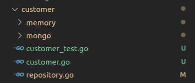
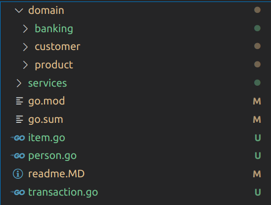

# Как структурировать DDD код в Golang


*Пора осуществить рефакторинг структуры. Gopher - Takuya Ueda, оригинальный Go gopher - Renée French*

Посмотрим как можно улучшить архитектуру при использовании DDD в проектах на Go.
В этой статье мы рассмотрим репозиторий, имеющий все составляющие DDD, и покажем
как организовать проект, сохраняя при этом DDD.

Репозиторий, который мы изменим, взят из моей предыдущей статьи о том, как 
реализовать DDD в Go. В той статье я объяснил все составляющие, присутствующие 
в DDD, как это сделал Эрик Эванс. Репозиторий можно найти на [Github](https://github.com/percybolmer/ddd-go).

> Все изображения из этой статьи созданы Percy Bolmér, Gopher создан [Takuya Ueda](https://twitter.com/tenntenn),
> вдохновленный работами Renée French. gopher был модифицирован на изображениях.

## Перемещаем агрегаты в соответствующий им пакет предметной области

Первое, что нужно сделать, - удалить весь пакет `aggregate`. Мы узнали что
такое агрегат и об ограничениях, накладываемых на него, поэтому нам необязательно
создавать пакет для него. Обычно я помещаю агрегаты в соответствующий пакет предметной
области, поэтому агрегат `Customer` должен находиться внутри предметной области
`customer`. На мой взгляд, в этом гораздо больше смысла.


*Удаляем агрегат `Customer` из пакета `aggregate`*

Конечно после перемещения файлов в предметную область `customer`, вам также 
нужно изменить любую ссылку, указывающую на `aggregate.Customer`, и заменить её
на `customer.Customer` или `Customer`, если вы находитесь в пакете `customer`.

```go
// CustomerRepository - это интерфейс, определяющий правила, которым должен
// удовлетворять репозиторий для хранения клиентов
type CustomerRepository interface {
    Get(uuid.UUID) (Customer, error)
    Add(Customer) error
    Update(Customer) error
}
```
*Заменяем все упоминания о пакете `aggregate`*

То же самое нужно сделать для агрегата `Product`, он должен находиться внутри 
предметной области `product`. Я не буду описывать все изменения в коде, достаточно
легко найти и провести рефакторинг всех упоминаний пакета `aggregate`.


*Предметная область `product` с перенесенным в неё агрегатом `product`*

Мне больше нравится такая структура, когда агрегат находится в пакете предметной
области, и в этом есть смысл.

Удалив папку `aggregate`, мы также подчищаем некоторый [код с запашком](https://ru.wikipedia.org/wiki/%D0%9A%D0%BE%D0%B4_%D1%81_%D0%B7%D0%B0%D0%BF%D0%B0%D1%88%D0%BA%D0%BE%D0%BC).


*Улучшенная, но не до конца, структура проекта*

## Перемещаем объекты-значения и сущности

У нас все еще есть папки для `entity` и `valueobject`, что, я думаю, что в этом
нет ничего плохого. Такое хранение совместно используемых структур в отдельном 
пакете позволяет избежать циклических импортов.  

Мы можем добиться этого другим способом, не создавая эти папки. Пока что у нас 
нет корневого пакета. Переместите все файлы из `entity` and `valueobject` в 
корень проекта и переименуйте пакет в `tavern`.

```go
package tavern

import "github.com/google/uuid"

// Item представляет собой элемент для всех подобластей
type Item struct {
    ID          uuid.UUID
    Name        string
    Description string
}
```
*item.go в корне проекта, пакет называется `tavern`*

Это приведёт к дальнейшему улучшению структуры.


*Перемещаем сущности и другие совместно используемые файлы в корневой пакет*

Вам также нужно будет переименовать ваш модуль в `go.mod`, поменяв его на 
`tavern`.

```
module github.com/MaksimDzhangirov/tavern
```

Кроме того, нужно изменить все импорты во всех файлах, чтобы отразить это изменение, и 
все ссылки на пакет `entity` должны быть изменены на `tavern` как показано ниже.

```go
// Пакет product
// Product - это агрегат, описывающий товар
package product

import (
    "errors"
    
    "github.com/MaksimDzhangirov/tavern"
    "github.com/google/uuid"
)

var (
    // ErrMissingValues возвращается, когда товар создаётся без названия или описания
    ErrMissingValues = errors.New("missing values")
)

// Product - это агрегат, объединяющий позицию в меню, цену и количество
type Product struct {
    // item - это корневая сущность, которой является Item
    item *tavern.Item
    price float64
    // quantity - количество товара на складе
    quantity int
}

// NewProduct создаст новый продукт
// вернет ошибку, если название или описание будет пустым
func NewProduct(name, description string, price float64) (Product, error) {
    if name == "" || description == "" {
        return Product{}, ErrMissingValues
    }
    
    return Product{
        item: &tavern.Item{
            ID: uuid.New(),
            Name: name,
            Description: description,
        },
        price: price,
        quantity: 0,
    }, nil
}

func (p Product) GetID() uuid.UUID {
    return p.item.ID
}

func (p Product) GetItem() *tavern.Item {
    return p.item
}

func (p Product) GetPrice() float64 {
    return p.price
}
```
*Заменяем все ссылки на пакет `entity` на `tavern` и весь импорт.*

Все импорты, которые начинались на `github.com/MaksimDzhangirov/DDD-and-go`,
заменяются на `github.com/MaksimDzhangirov/tavern`.

Самый простой способ сделать это — изменить все файлы, удалить `go.mod` и 
`go.sum` и повторно инициализировать Go модуль, задав новое имя:

```shell
go mod init github.com/MaksimDzhangirov/tavern
```

Это потребует немалых усилий, но оно стоит того. Вы можете повторно запустить все 
тесты, чтобы убедиться, что ничего не сломалось.

## Разбиваем пакет Services

Сейчас пакет `services` содержит все сервисы. Я хочу разделить их на два 
пакета: `Order` и `Tavern`.

Дело в том, что по мере роста проекта, хорошей практикой является разделение 
сервисов на более мелкие пакеты. Если хранить их всех в одном пакете, он 
становится слишком нагроможденным. Мне также нравится хранить предметную область
как часть инфраструктуры, поэтому мы создадим новую папку `order` в `services`.
Причина в том, что в будущем мы можем добавить больше сервисов, связанных с 
заказами. Например, текущий сервис `Order` ориентирован на клиента, который 
заказывает напитки, но Таверне тоже нужно будет пополнять запасы. Используя 
такую структуру разработчики могут легко найти необходимый им код.

Еще один важный момент — это название функций конфигурации. Если мы продолжим 
создавать такие функции как `WithMemoryCustomerRepository`, будет трудно понять
к чему относится данная конфигурация. Намного проще будет понять что происходит, 
используя такое название `order.WithMemoryCustomerRepository`.


*Пакет `services` разбиваем на подпакеты*

Внесение этого изменения требует, чтобы пакет `tavern` ссылался на 
`order.OrderService`, а не на просто `OrderService`.

Изменим все ссылки, чтобы они соответствовали новой структуре. Мы также создадим
новую функцию в `OrderService`, чтобы можно было добавлять новых клиентов, 
потому что сейчас мы можем сделать это только с помощью репозитория 
`CustomerRepository` внутри сервиса. Но репозиторий не доступен другим пакетам 
вне сервиса. Кроме того, сервис никогда не должна предполагать, что тот кто 
будет его использовать знает о его внутреннем устройстве. Таким образом 
вполне естественно, что добавление новых клиентов должно быть реализовано на 
уровне сервиса.

```go
// AddCustomer добавит нового клиента и вернёт customerID
func (o *OrderService) AddCustomer(name string) (uuid.UUID, error) {
    c, err := customer.NewCustomer(name)
    if err != nil {
        return uuid.Nil, err
    }
    // Добавляем в репозиторий
    err = o.customers.Add(c)
    if err != nil {
        return uuid.Nil, err
    }
    
    return c.GetID(), nil
}
```
*Создаём метод `AddCustomer` для добавления новых Клиентов*

После внедрения этих изменений, тестировать заказ товара стала ещё проще.

```go
func Test_Tavern(t *testing.T) {
    // Создаём OrderService
    products := init_products(t)
    
    os, err := order.NewOrderService(
        order.WithMemoryCustomerRepository(),
        order.WithMemoryProductRepository(products),
    )
    if err != nil {
        t.Error(err)
    }
    
    tavern, err := NewTavern(WithOrderService(os))
    if err != nil {
        t.Error(err)
    }
    
    uid, err := os.AddCustomer("Percy")
    if err != nil {
        t.Error(err)
    }
    order := []uuid.UUID{
        products[0].GetID(),
    }
    // Выполняем заказ
    err = tavern.Order(uid, order)
    if err != nil {
        t.Error(err)
    }

}
```

Теперь мы получили окончательную структуру. Очень простой в навигации,
четко структурированный проект.


*Окончательная структура проекта*

## Запускаем проект Таверна

И последнее, что я бы хотел вам порекомендовать, - использовать папку `cmd`, 
которая существует во многих репозиториях Go. В этой папке должны находиться все
инструменты командной строки, и их может быть несколько. В заключение этой 
статьи я создам программу `main` в папке `cmd`.

```shell
mkdir cmd
touch main.go
```

Давайте закажем пива, чтобы отпраздновать конец работы.

```go

```
*Попробуйте запустить программу, чтобы убедиться, что всё работает как надо*

> Прим. пер. - Здесь автор использовал каламбур:
> "everything is in order" можно перевести как "всё работает как надо", так и 
> "everything is in order" - "всё что нужно было добавлено в заказ"

## Заключение

На этом закончим оченб длинную статью о DDD из двух частей.

Код всего приложения можно найти на [Github](https://github.com/percybolmer/ddd-go/tree/clean-architecture).

Эта статья касается только основ и того как я структурирую проекты, поэтому вам 
ещё предстоит многое узнать о DDD. Мы не затронули пока такие темы как события 
предметной области (`Domain events`), [`CQRS`](https://ru.wikipedia.org/wiki/CQRS) 
и `Event Sourcing`. Следите за появлениями новых статей.

Если вы хотите узнать больше о DDD, я рекомендую книгу Эрика Эванса 
"Предметно-ориентированное проектирование: структуризация сложных программных 
систем". Вы можете купить её на [Amazon](https://amzn.to/3yd920L).

> Обратите внимание, что ссылка является партнерской, это означает, что я также
> получаю процент, когда она используется для покупки.

Как всегда, не стесняйтесь обращаться ко мне в любой из моих социальных сетей.
Я люблю отзывы, критику и даже [флейминг](https://ru.wikipedia.org/wiki/%D0%A4%D0%BB%D0%B5%D0%B9%D0%BC).

Можете написать мне здесь на Medium, в [Twitter](https://twitter.com/percybolmer),
[Instagram](https://www.instagram.com/programmingpercy/) и
[Linkedin](https://www.linkedin.com/in/percy-bolmer-bb223b122/).